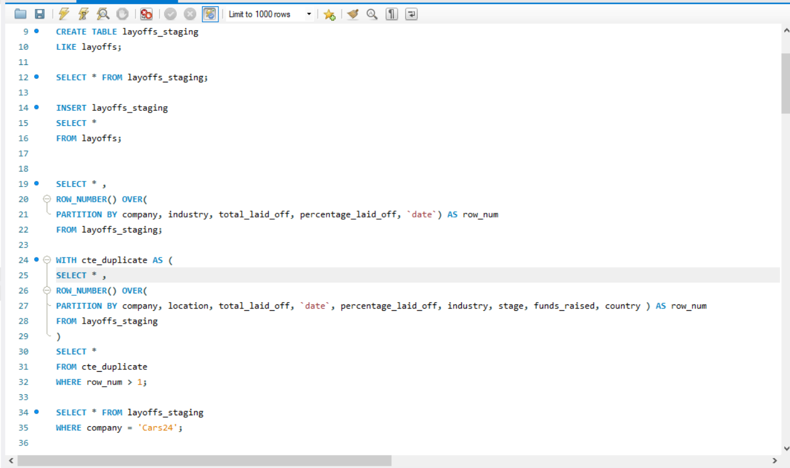
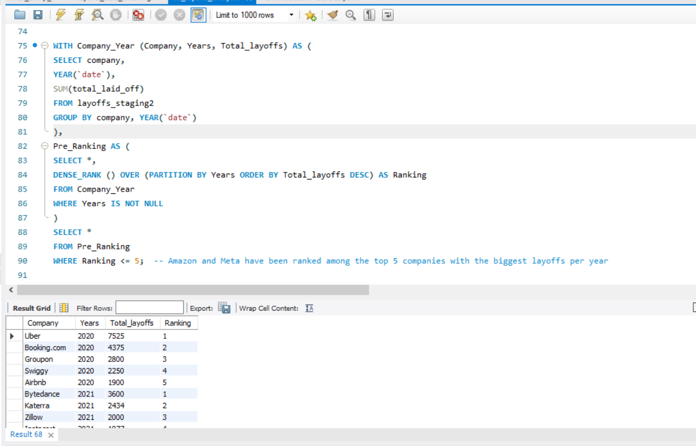

# Tech Layoffs Analysis (SQL Project)

## Overview
This project analyzes a global tech layoffs dataset (sourced from Kaggle) using SQL.

The goal was to take a raw, inconsistent dataset, clean it properly, and then explore it to uncover trends in layoffs across companies, industries, countries, and time.

All analysis was performed using MySQL.

---

## Dataset
The dataset contains records of layoffs from **2020 to 2026**, covering a 6-year period across multiple companies and industries, including:

- Company name  
- Location and country  
- Industry  
- Total layoffs  
- Percentage laid off  
- Funding stage  
- Dates (layoff date and date added)  

---

## Data Cleaning

The dataset required significant cleaning before analysis:

### 1. Removing Duplicates
- Used `ROW_NUMBER()` with partitions across key columns  
- Identified and removed duplicate records using a staging table  

### 2. Standardizing Data
- Trimmed inconsistent company names  
- Standardized location values (e.g., "Bengaluru", "London", etc.)  
- Converted date fields from text to proper `DATE` format  

### 3. Handling Missing Values
- Removed rows where both `total_laid_off` and `percentage_laid_off` were missing  
- Converted blank values to `NULL` where necessary  

### 4. Data Type Fixes
- Converted `total_laid_off` to `INT`  
- Ensured date columns were stored correctly for time-based analysis  

---

## Exploratory Data Analysis (EDA)

After cleaning, the dataset was analyzed to identify patterns and trends.

### Key Areas Explored

- Companies with the highest total layoffs  
- Layoffs by industry  
- Layoffs by country  
- Yearly and monthly trends  
- Rolling totals over time  
- Layoffs by funding stage  
- Frequency of layoffs per company  

---

## Key Insights

- A large proportion of layoffs occurred in the **United States**, significantly higher than other countries  
- **Amazon** recorded the highest total layoffs (~58k across multiple years)  
- **2023** had the highest number of layoffs overall  
- Certain industries (e.g., Retail, Hardware, Consumer) were more heavily impacted  
- Early-stage companies (e.g., **Seed stage**) showed a higher likelihood of complete shutdowns  
- Some companies had **multiple layoff rounds**, indicating prolonged instability  

---

## Files

- `01_layoffs_data_cleaning.sql` — Data cleaning and preparation  
- `02_layoffs_analysis.sql` — Exploratory data analysis queries  
- `layoffs_dump.sql` — Database dump file  

## Screenshots

### Data Cleaning

### Exploratory Data Analysis

---

## Tools Used

- MySQL  
- SQL (CTEs, Window Functions, Aggregations)

---

## What I Learned

- Data cleaning is critical before any meaningful analysis  
- Window functions (e.g., `ROW_NUMBER`, `DENSE_RANK`) are powerful for real-world datasets  
- Small inconsistencies (dates, locations) can significantly affect results  
- SQL alone can be used to extract strong business insights without visualization  

---
